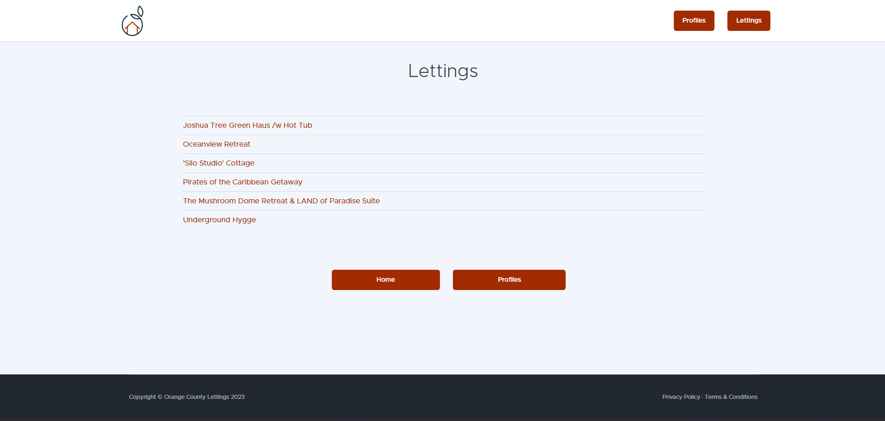
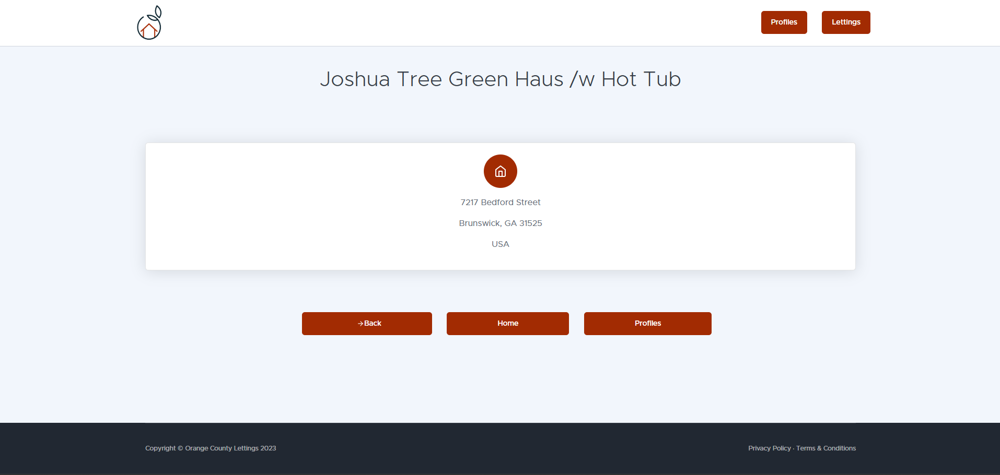
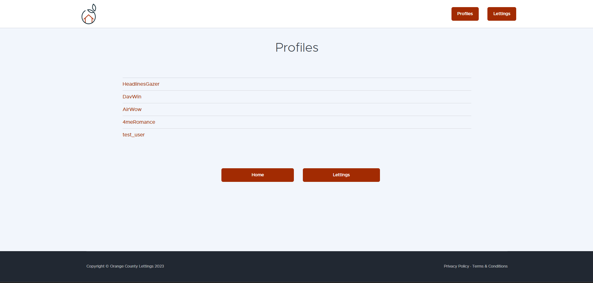
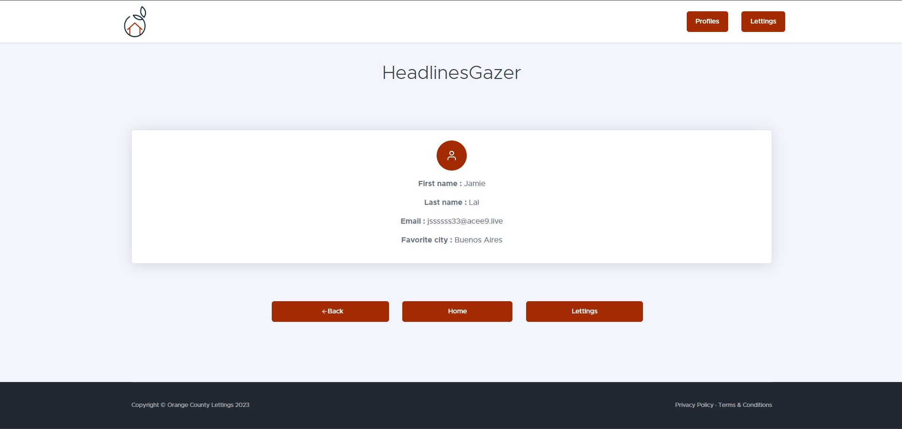
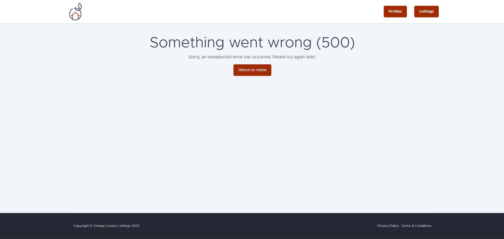
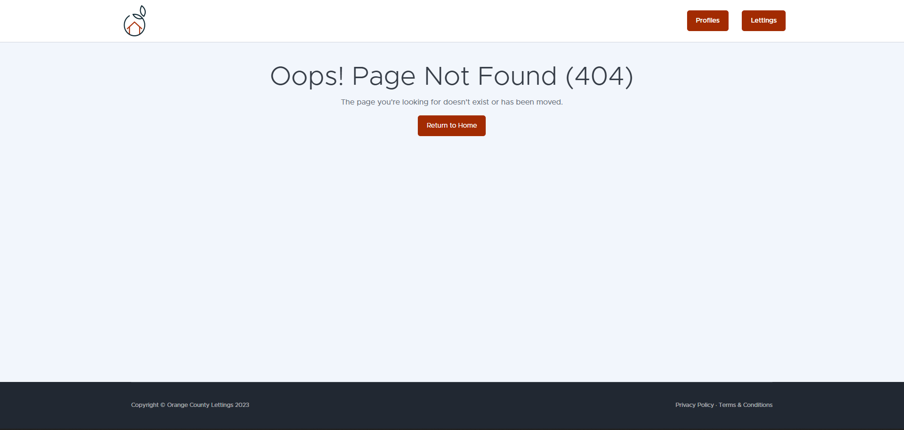
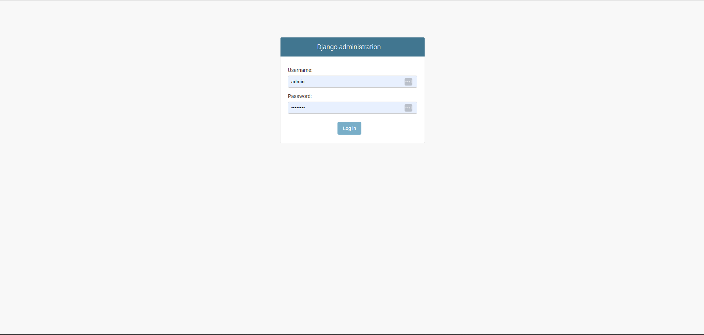
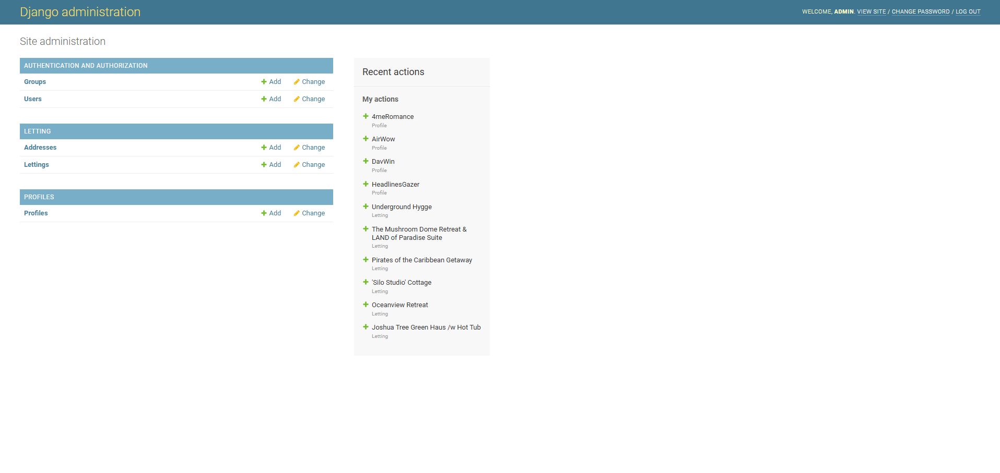
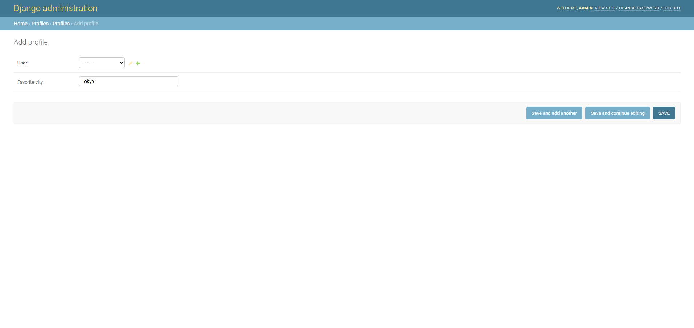
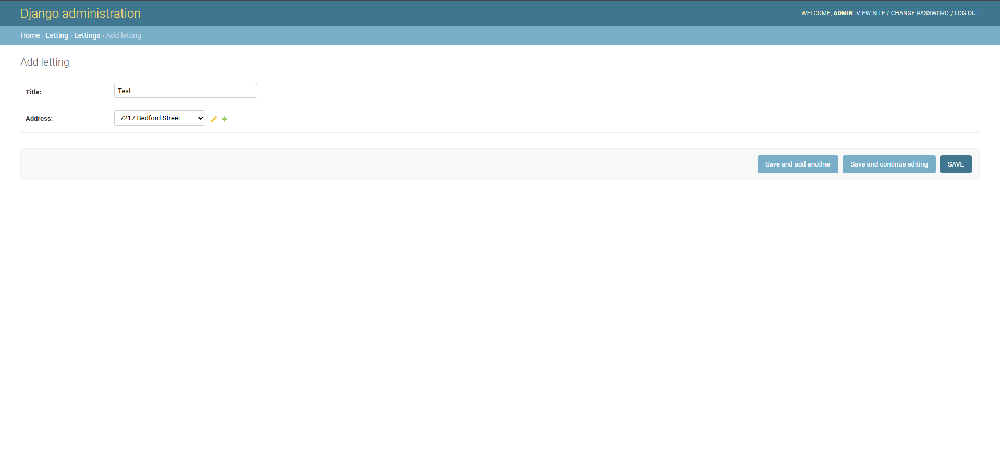

User guide
==========================================

Overview
--------

This web application allows users to view available lettings and profile information.

How to Access
-------------

Production URL:
https://p13-docker.onrender.com

User Interface
---------------

This section describes how a visitor can use the public-facing part of the application.

**Browse all lettings**
~~~~~~~~~~~~~~~~~~~~~~~~~~

Go to the homepage and click on “Lettings”.

**View letting details**
~~~~~~~~~~~~~~~~~~~~~~~~~~

Select a letting from the list to view its full address.

**View profiles list**
~~~~~~~~~~~~~~~~~~~~~~~~

Go to the homepage et click on "Profiles".

**View profiles details**
~~~~~~~~~~~~~~~~~~~~~~~~~~

Navigate to the “Profiles” section and select a user.

**Trigger an 500 error**
~~~~~~~~~~~~~~~~~~~~~~~~~~

Visit the special route `/debug-sentry/` to simulate a 500 error.

**Trigger an 404 error**
~~~~~~~~~~~~~~~~~~~~~~~~~~

Try accessing a non-existent URL such as `/profiles/test/`

Admin Interface
-----------------

This section is intended for project administrators.

**Access the Django admin panel**
~~~~~~~~~~~~~~~~~~~~~~~~~~~~~~~~~~
Go to `/admin/` and log in with superuser credentials.

**Manage data through the interface**
~~~~~~~~~~~~~~~~~~~~~~~~~~~~~~~~~~~~~~~~
Once logged in, admins can create, edit, and delete:

- **Lettings**: each letting must be linked to an existing address.
- **Addresses**: address records are created independently and associated with lettings.
- **Users**: standard Django users, which are required to create profiles.
- **Profiles**: each profile is strictly linked to a single user account.

To access the admin panel, use these credentials :

.. code-block:: bash

    user : admin
    password : Abc1234!

or create a super user:

.. code-block:: bash

    python manage.py createsuperuser

**Admin dashboard overview**

Once logged in, you’ll see the Django admin dashboard.
From here, you can manage users, profiles, lettings, and addresses.

**Create a new profile**
~~~~~~~~~~~~~~~~~~~~~~~~~~

To create a new profile:

1. First, go to the **Users** section and create a new user if it doesn't exist.
2. Then, go to the **Profiles** section and click **Add Profile**.
3. Select the user from the dropdown menu.
4. Fill in the additional fields (e.g., favorite city) and click **Save**.

**Create a new letting**
~~~~~~~~~~~~~~~~~~~~~~~~~~

To create a new letting:

1. First, go to the **Addresses** section and add a new address.
2. Then, go to the **Lettings** section and click **Add Letting**.
3. Enter a title and select the address you just created.
4. Click **Save** to create the letting.

